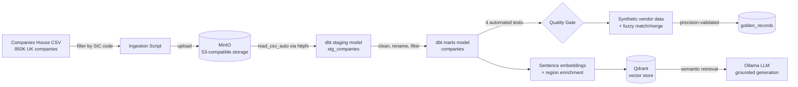

# Data Lake Lab

A local-first data lakehouse and AI-readiness pipeline — built entirely on
self-hosted infrastructure at zero cloud cost, using UK Companies House data
filtered to the beverage and alcohol manufacturing sector.

The project demonstrates the full path from raw data ingestion through to
AI-ready retrieval: object storage, SQL transformation with automated testing,
entity resolution (MDM), and a grounded RAG pipeline — each layer built on
open-source tools chosen as direct, honestly-labeled equivalents to their
managed-cloud counterparts (e.g. MinIO ≈ S3, DuckDB+dbt ≈ a managed lakehouse
warehouse).

## Architecture

## Key results

- **1,559** beverage/alcohol companies filtered from 850,000 Companies House
  records, **1,387** retained after data-quality status filtering
- **100% precision** on entity matching (0 false positives across 294 asserted
  matches), with a measured, deliberate precision/recall trade-off on the
  remainder
- **4/4 automated data quality tests passing** (uniqueness, completeness, status
  validation) via dbt
- A RAG pipeline with **two independent grounding mechanisms**, both tested
  against adversarial queries (out-of-domain questions correctly refused)

## Tech stack

| Layer | Tool | Real-world equivalent |
|---|---|---|
| Object storage | MinIO | AWS S3 |
| Transformation | dbt-core + DuckDB | Databricks / Snowflake + dbt |
| Entity resolution | rapidfuzz | Enterprise MDM platforms |
| Vector search | Qdrant | Managed vector DB (Pinecone, etc.) |
| Embeddings | sentence-transformers | Bedrock / OpenAI embeddings |
| Generation | Ollama (local LLM) | Bedrock / Azure OpenAI |

## Notable engineering decisions

- **Deliberately excluded non-Active companies** (Liquidation, Administration,
  Proposal to Strike Off) from the business-ready dataset — a documented
  judgment call, not a silent filter.
- **Materialized the transformation output as a table, not a view** — avoided a
  live dependency on storage credentials for every downstream consumer.
- **Redesigned a flawed evaluation metric** after a borderline case exposed that
  it conflated "wrong guess" with "correctly abstained" — precision and recall
  are now reported separately.
- **Found and partially fixed a geographic retrieval gap**: named regions
  (e.g. "Scotland") retrieve reliably after adding explicit region text to each
  embedded document; relative/directional queries (e.g. "north of England")
  remain a known, documented limitation of small general-purpose embedding
  models — not engineered around further, as a deliberate scope decision.
- **Found the generation layer silently omits relevant context** on some
  queries (not hallucination — a distinct, separately-tested failure mode) —
  documented rather than hidden.

## Project logs

Full week-by-week build narrative, including real debugging encountered:
- [Week 1 — Ingestion & Lakehouse Storage](docs/week1-log.md)
- [Week 2 — dbt Transformation Layer](docs/week2-log.md)
- [Week 3 — Master Data Management](docs/week3-log.md)
- [Week 4 — RAG & AI-Ready Data Layer](docs/week4-log.md)

## Reproducing this project

See [docs/project.md](docs/project.md) for step-by-step setup instructions
(currently covers Weeks 1–2; ingestion through dbt transformation).
